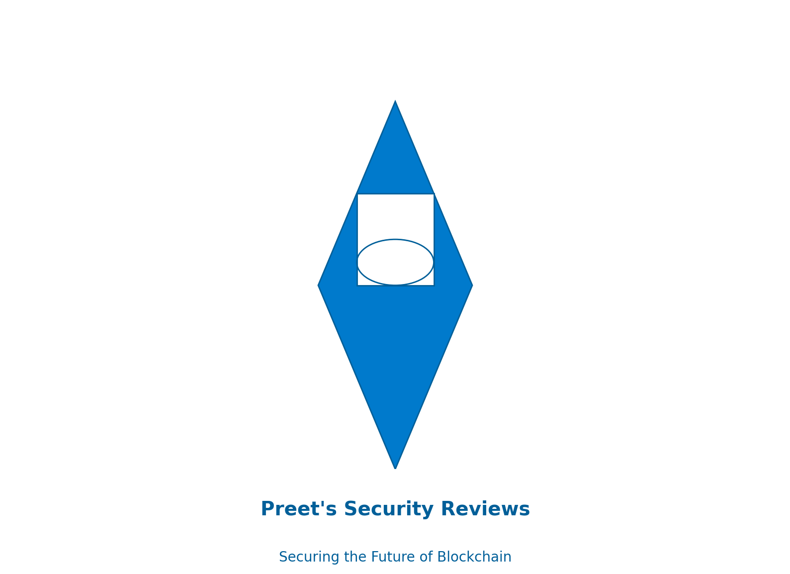

# Smart Contract Security Reviews

 

 

Welcome to the Smart Contract Security Reviews repository! This repository contains security reviews and audits of various smart contracts conducted by Preet.

- [About](#about)
- [Latest Review](#latest-review)
- [View the Recent Security Review Repository](#view-the-recent-security-review-repository)
- [How to Contribute](#how-to-contribute)
- [Contact](#contact)

## About

This repository is dedicated to documenting my journey as I learn about smart contract security auditing. Each review provides insights into the security aspects of the audited smart contracts, including potential vulnerabilities and recommendations for improvements.

## Latest Review

- **[PasswordStore Smart Contract Audit](./PasswordStore-Security-Review.pdf)**  
  This is a basic security audit of a sample smart contract. It includes an analysis of potential vulnerabilities and recommendations for enhancing security.

## View the Recent Security Review Repository

Visit the repository for the most recent security review:

[PasswordStore Audit Repository](https://github.com/preetsinghmakkar/cyfrin-passwordStore-audit/tree/passwordstore-audit)

## How to Contribute

As I continue learning and conducting security reviews, contributions, feedback, and suggestions are highly appreciated! Here's how you can contribute:

- **Feedback**: If you have any suggestions, feedback, or corrections regarding the audit reports, feel free to open an issue or submit a pull request.
- **Request a Review**: Have a smart contract you want me to review? Open an issue with details, and I'll consider it for the next review.
- **Spread the Word**: If you find this repository helpful, consider giving it a star and sharing it with others who might benefit from it.

## Contact

Feel free to reach out to me via [LinkedIn](https://www.linkedin.com/in/preet-singh-a65967302/) or [Twitter](https://twitter.com/Preet132319) for any inquiries or collaborations.
